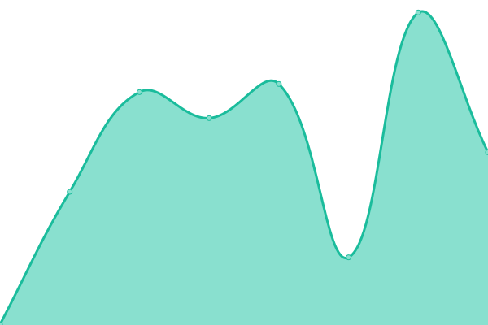
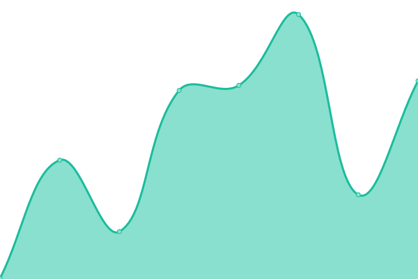
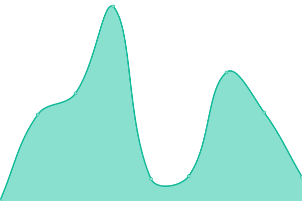
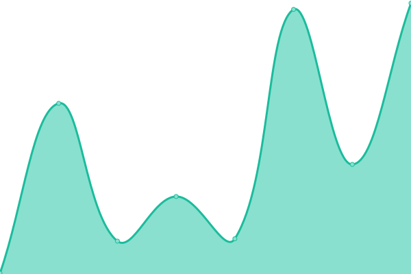

# [📈 Live Status](https://upptime.github.io/upptime): <!--live status--> **🟧 Partial outage**

This repository contains the open-source uptime monitor and status page for [Upptime](https://upptime.js.org), powered by [Upptime](https://github.com/upptime/upptime).

With [Upptime](https://upptime.js.org), you can get your own unlimited and free uptime monitor and status page, powered entirely by a GitHub repository. We use [Issues](https://github.com/upptime/upptime/issues) as incident reports, [Actions](https://github.com/DavidCarbon-SBRW/Status/actions) as uptime monitors, and [Pages](https://upptime.github.io/upptime) for the status page.

<!--start: status pages-->
<!-- This summary is generated by Upptime (https://github.com/upptime/upptime) -->
<!-- Do not edit this manually, your changes will be overwritten -->
<!-- prettier-ignore -->
| URL | Status | History | Response Time | Uptime |
| --- | ------ | ------- | ------------- | ------ |
|  [(API) WorldUnited.gg List](https://api.worldunited.gg/serverlist.json) | 🟥 Down | [api-world-united-gg-list.yml](https://github.com/DavidCarbon-SBRW/Status/commits/HEAD/history/api-world-united-gg-list.yml) | 

 237ms
     
 | 

<a href="https://s-sbrw.davidcarbon.download/history/api-world-united-gg-list">0.46%</a>
    

|  [(API) DavidCarbon - Main List](https://api-sbrw.davidcarbon.download/serverlist.json) | 🟩 Up | [api-david-carbon-main-list.yml](https://github.com/DavidCarbon-SBRW/Status/commits/HEAD/history/api-david-carbon-main-list.yml) | 

 302ms
     
 | 

<a href="https://s-sbrw.davidcarbon.download/history/api-david-carbon-main-list">100.00%</a>
    

|  [(API) DavidCarbon - Backup List](http://api2-sbrw.davidcarbon.download/serverlist.json) | 🟩 Up | [api-david-carbon-backup-list.yml](https://github.com/DavidCarbon-SBRW/Status/commits/HEAD/history/api-david-carbon-backup-list.yml) | 

 168ms
     
 | 

<a href="https://s-sbrw.davidcarbon.download/history/api-david-carbon-backup-list">100.00%</a>
    

|  [(API) WOPL - List](http://worldonline.pl/serverlist.json) | 🟩 Up | [api-wopl-list.yml](https://github.com/DavidCarbon-SBRW/Status/commits/HEAD/history/api-wopl-list.yml) | 

 230ms
     
 | 

<a href="https://s-sbrw.davidcarbon.download/history/api-wopl-list">100.00%</a>
    

|  [(CDN) WorldUnited.gg Mirror](https://cdn.worldunited.gg/en/index.xml) | 🟩 Up | [cdn-world-united-gg-mirror.yml](https://github.com/DavidCarbon-SBRW/Status/commits/HEAD/history/cdn-world-united-gg-mirror.yml) | 

 191ms
     
 | 

<a href="https://s-sbrw.davidcarbon.download/history/cdn-world-united-gg-mirror">100.00%</a>
    

|  [(CDN) DavidCarbon Mirror](http://g-sbrw.davidcarbon.download/en/index.xml) | 🟩 Up | [cdn-david-carbon-mirror.yml](https://github.com/DavidCarbon-SBRW/Status/commits/HEAD/history/cdn-david-carbon-mirror.yml) | 

 281ms
     
 | 

<a href="https://s-sbrw.davidcarbon.download/history/cdn-david-carbon-mirror">100.00%</a>
    

|  [(CDN) NightRiderz Mirror](https://cdn.nightriderz.world/nfsw/en/index.xml) | 🟩 Up | [cdn-night-riderz-mirror.yml](https://github.com/DavidCarbon-SBRW/Status/commits/HEAD/history/cdn-night-riderz-mirror.yml) | 

 623ms
     
 | 

<a href="https://s-sbrw.davidcarbon.download/history/cdn-night-riderz-mirror">100.00%</a>
    

|  [(CDN) DavidCarbon Mirror - Alternative](http://g2-sbrw.davidcarbon.download/en/index.xml) | 🟩 Up | [cdn-david-carbon-mirror-alternative.yml](https://github.com/DavidCarbon-SBRW/Status/commits/HEAD/history/cdn-david-carbon-mirror-alternative.yml) | 

 199ms
     
 | 

<a href="https://s-sbrw.davidcarbon.download/history/cdn-david-carbon-mirror-alternative">100.00%</a>
    

|  [(Server) WorldUnited OFFICIAL](http://game.worldunited.gg:8080/Engine.svc/GetServerInformation) | 🟩 Up | [server-world-united-official.yml](https://github.com/DavidCarbon-SBRW/Status/commits/HEAD/history/server-world-united-official.yml) | 

 137ms
     
 | 

<a href="https://s-sbrw.davidcarbon.download/history/server-world-united-official">100.00%</a>
    

|  [(Server) NIGHTRIDERZ - HORIZON](http://horizon.nightriderz.world:8080/Engine.svc/GetServerInformation) | 🟩 Up | [server-nightriderz-horizon.yml](https://github.com/DavidCarbon-SBRW/Status/commits/HEAD/history/server-nightriderz-horizon.yml) | 

 367ms
     
 | 

<a href="https://s-sbrw.davidcarbon.download/history/server-nightriderz-horizon">100.00%</a>
    

|  [(Server) World Evolved RU](http://92.63.111.195:8680/soapbox-race-core/Engine.svc/GetServerInformation) | 🟩 Up | [server-world-evolved-ru.yml](https://github.com/DavidCarbon-SBRW/Status/commits/HEAD/history/server-world-evolved-ru.yml) | 

 296ms
     
 | 

<a href="https://s-sbrw.davidcarbon.download/history/server-world-evolved-ru">100.00%</a>
    

|  [(Server) Sparkserver](https://core.sparkserver.io/soapbox-race-core/Engine.svc/GetServerInformation) | 🟩 Up | [server-sparkserver.yml](https://github.com/DavidCarbon-SBRW/Status/commits/HEAD/history/server-sparkserver.yml) | 

 372ms
     
 | 

<a href="https://s-sbrw.davidcarbon.download/history/server-sparkserver">100.00%</a>
    

|  [(Server) UNDERGROUND STAGE - BETA](http://155.138.131.23:8080/core/Engine.svc/GetServerInformation) | 🟩 Up | [server-underground-stage-beta.yml](https://github.com/DavidCarbon-SBRW/Status/commits/HEAD/history/server-underground-stage-beta.yml) | 

 75ms
     
 | 

<a href="https://s-sbrw.davidcarbon.download/history/server-underground-stage-beta">100.00%</a>
    

|  [(Server) WorldOnline](http://worldonline.pl:2137/Engine.svc/GetServerInformation) | 🟩 Up | [server-world-online.yml](https://github.com/DavidCarbon-SBRW/Status/commits/HEAD/history/server-world-online.yml) | 

 251ms
     
 | 

<a href="https://s-sbrw.davidcarbon.download/history/server-world-online">100.00%</a>
    

<!--end: status pages-->

[**Visit our status website →**](https://upptime.github.io/upptime)

## 📄 License

- Powered by: [Upptime](https://github.com/upptime/upptime)
- Code: [MIT](./LICENSE) © [Upptime](https://upptime.js.org)
- Data in the `./history` directory: [Open Database License](https://opendatacommons.org/licenses/odbl/1-0/)
