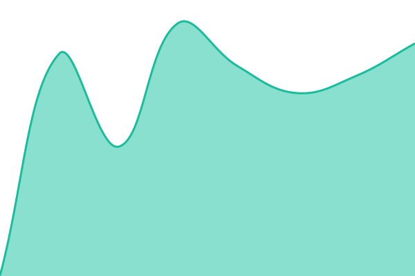
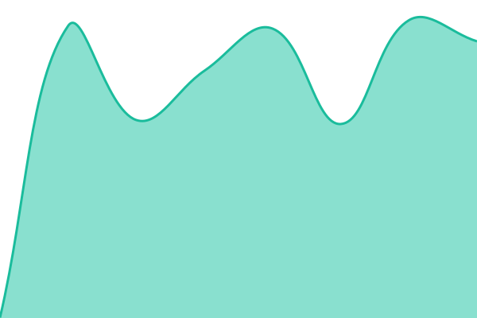
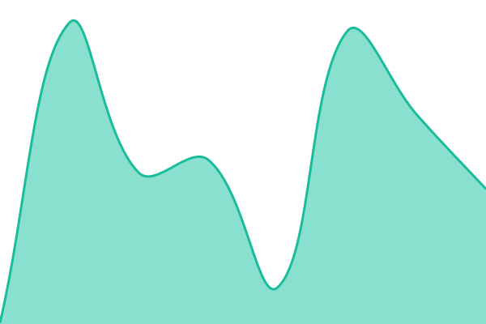
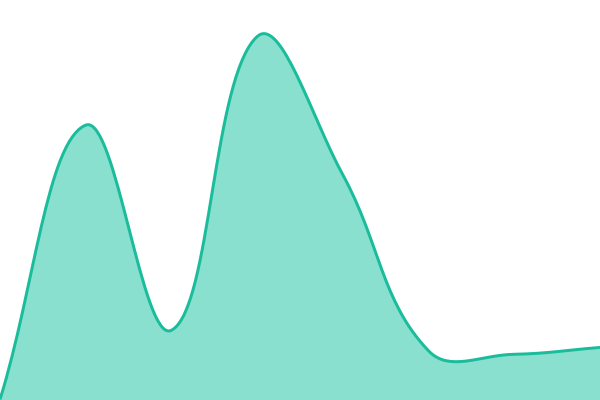
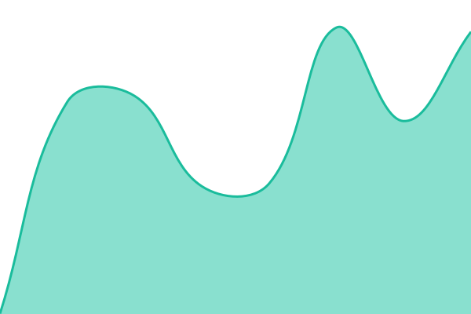
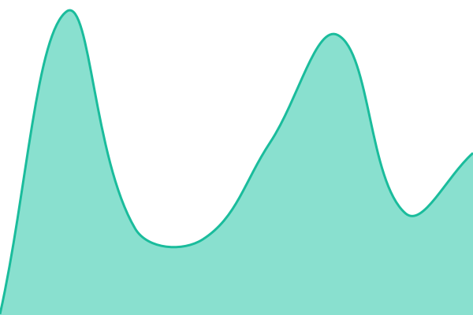
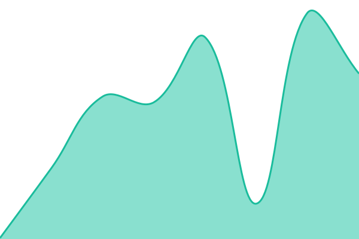
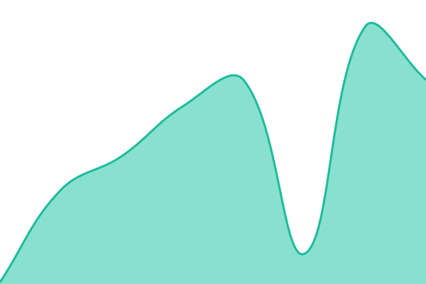
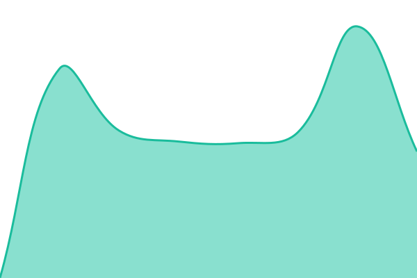

# [📈 Live Status](https://upptime.github.io/upptime): <!--live status--> **🟧 Partial outage**

This repository contains the open-source uptime monitor and status page for [Upptime](https://upptime.js.org), powered by [Upptime](https://github.com/upptime/upptime).

With [Upptime](https://upptime.js.org), you can get your own unlimited and free uptime monitor and status page, powered entirely by a GitHub repository. We use [Issues](https://github.com/upptime/upptime/issues) as incident reports, [Actions](https://github.com/DavidCarbon-SBRW/Status/actions) as uptime monitors, and [Pages](https://upptime.github.io/upptime) for the status page.

<!--start: status pages-->
<!-- This summary is generated by Upptime (https://github.com/upptime/upptime) -->
<!-- Do not edit this manually, your changes will be overwritten -->
<!-- prettier-ignore -->
| URL | Status | History | Response Time | Uptime |
| --- | ------ | ------- | ------------- | ------ |
|  [(API) WorldUnited.gg List](https://api.worldunited.gg/serverlist.json) | 🟩 Up | [api-wugg.yml](https://github.com/DavidCarbon-SBRW/Status/commits/HEAD/history/api-wugg.yml) | 

 767ms
     
 | 

<a href="https://s-sbrw.davidcarbon.download/history/api-wugg">100.00%</a>
    

|  [(API) DavidCarbon - Main List](https://api-sbrw.davidcarbon.download/serverlist.json) | 🟩 Up | [api-dc-main.yml](https://github.com/DavidCarbon-SBRW/Status/commits/HEAD/history/api-dc-main.yml) | 

 546ms
     
 | 

<a href="https://s-sbrw.davidcarbon.download/history/api-dc-main">100.00%</a>
    

|  [(API) DavidCarbon - Backup List](http://api2-sbrw.davidcarbon.download/serverlist.json) | 🟩 Up | [api-dc-bkup.yml](https://github.com/DavidCarbon-SBRW/Status/commits/HEAD/history/api-dc-bkup.yml) | 

 273ms
     
 | 

<a href="https://s-sbrw.davidcarbon.download/history/api-dc-bkup">100.00%</a>
    

|  [(CDN) WorldUnited.gg Mirror](https://cdn.worldunited.gg/en/index.xml) | 🟩 Up | [cdn-wugg.yml](https://github.com/DavidCarbon-SBRW/Status/commits/HEAD/history/cdn-wugg.yml) | 

 155ms
     
 | 

<a href="https://s-sbrw.davidcarbon.download/history/cdn-wugg">100.00%</a>
    

|  [(CDN) DavidCarbon Mirror](http://g-sbrw.davidcarbon.download/en/index.xml) | 🟩 Up | [cdn-dc.yml](https://github.com/DavidCarbon-SBRW/Status/commits/HEAD/history/cdn-dc.yml) | 

 208ms
     
 | 

<a href="https://s-sbrw.davidcarbon.download/history/cdn-dc">100.00%</a>
    

|  [(CDN) NightRiderz Mirror](https://game.cdn.nightriderz.world/en/index.xml) | 🟩 Up | [cdn-nr.yml](https://github.com/DavidCarbon-SBRW/Status/commits/HEAD/history/cdn-nr.yml) | 

 367ms
     
 | 

<a href="https://s-sbrw.davidcarbon.download/history/cdn-nr">100.00%</a>
    

|  [(CDN) DavidCarbon Mirror - Alternative](http://g2-sbrw.davidcarbon.download/en/index.xml) | 🟩 Up | [cdn-dc-alt.yml](https://github.com/DavidCarbon-SBRW/Status/commits/HEAD/history/cdn-dc-alt.yml) | 

 129ms
     
 | 

<a href="https://s-sbrw.davidcarbon.download/history/cdn-dc-alt">100.00%</a>
    

|  [(Server) WorldUnited OFFICIAL](http://game.worldunited.gg:8080/Engine.svc/GetServerInformation) | 🟩 Up | [server-wugg.yml](https://github.com/DavidCarbon-SBRW/Status/commits/HEAD/history/server-wugg.yml) | 

 213ms
     
 | 

<a href="https://s-sbrw.davidcarbon.download/history/server-wugg">100.00%</a>
    

|  [(Server) NIGHTRIDERZ: Horizon](https://horizon.nightriderz.world/Engine.svc/GetServerInformation) | 🟩 Up | [server-nr.yml](https://github.com/DavidCarbon-SBRW/Status/commits/HEAD/history/server-nr.yml) | 

 471ms
     
 | 

<a href="https://s-sbrw.davidcarbon.download/history/server-nr">100.00%</a>
    

|  [(Server) World Evolved RU](http://92.63.111.195:8680/soapbox-race-core/Engine.svc/GetServerInformation) | 🟥 Down | [server-we.yml](https://github.com/DavidCarbon-SBRW/Status/commits/HEAD/history/server-we.yml) | 

 0ms
     
 | 

<a href="https://s-sbrw.davidcarbon.download/history/server-we">0.00%</a>
    

|  [(Server) Sparkserver](https://core.sparkserver.io/soapbox-race-core/Engine.svc/GetServerInformation) | 🟩 Up | [server-spark.yml](https://github.com/DavidCarbon-SBRW/Status/commits/HEAD/history/server-spark.yml) | 

 417ms
     
 | 

<a href="https://s-sbrw.davidcarbon.download/history/server-spark">100.00%</a>
    

|  [(Server) UNDERGROUND STAGE](https://core.undergroundstage.net/Engine.svc/GetServerInformation) | 🟩 Up | [server-ugs.yml](https://github.com/DavidCarbon-SBRW/Status/commits/HEAD/history/server-ugs.yml) | 

 150ms
     
 | 

<a href="https://s-sbrw.davidcarbon.download/history/server-ugs">100.00%</a>
    

|  [(Server) OVERDRIVE](http://overdriveworld.com:8080/Engine.svc/GetServerInformation) | 🟩 Up | [server-od.yml](https://github.com/DavidCarbon-SBRW/Status/commits/HEAD/history/server-od.yml) | 

 132ms
     
 | 

<a href="https://s-sbrw.davidcarbon.download/history/server-od">100.00%</a>
    

|  (Server Development) WorldUnited DEVELOPMENT | 🟩 Up | [server-wugg-dev.yml](https://github.com/DavidCarbon-SBRW/Status/commits/HEAD/history/server-wugg-dev.yml) | 

 65ms
     
 | 

<a href="https://s-sbrw.davidcarbon.download/history/server-wugg-dev">100.00%</a>
    

|  [(Server Development) NIGHTRIDERZ: The Lab](https://core.thelab.nightriderz.world/Engine.svc/GetServerInformation) | 🟩 Up | [server-nr-dev.yml](https://github.com/DavidCarbon-SBRW/Status/commits/HEAD/history/server-nr-dev.yml) | 

 598ms
     
 | 

<a href="https://s-sbrw.davidcarbon.download/history/server-nr-dev">66.93%</a>
    

<!--end: status pages-->

[**Visit our status website →**](https://upptime.github.io/upptime)

## 📄 License

- Powered by: [Upptime](https://github.com/upptime/upptime)
- Code: [MIT](./LICENSE) © [Upptime](https://upptime.js.org)
- Data in the `./history` directory: [Open Database License](https://opendatacommons.org/licenses/odbl/1-0/)
